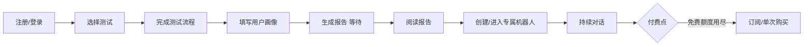

# 心镜（SoulMirror）移动端可实施方案

> 基于《心镜》精神抚慰平台项目计划书，面向 **iOS + Android 双端 App** 的首期落地规划。  
> UI 方向：简约、清爽、浅色主题，参考 Galaxy AI 式留白与圆角卡片体系。

---

## 一、产品定位与首期边界

### 1.1 一句话定位

**用四种自我探索测试（八字 / MBTI / 塔罗 / 手相）生成专属 AI 陪伴机器人，为轻度情绪困扰用户提供低门槛、高共鸣的精神抚慰。**

### 1.2 与项目书目标的对应

| 项目书目标 | 首期 App 策略 |
|-----------|--------------|
| 测试报告 ≥ 2000 字 | MVP 先保证 **结构化长报告**（分章节 + 可展开），二期再优化文风与长度 |
| 机器人自然、共情 | 首期：**单角色对话 + 测试摘要注入**；长期记忆、多风格放二期 |
| 6 个月 10 万注册 | 先做 **核心闭环可分享**（报告卡片、邀请码），增长功能分期 |
| 隐私与危机预警 | **首期必做**：匿名模式、一键删号、敏感词危机引导 |

### 1.3 MVP 范围（建议 10–12 周可交付）

**纳入 MVP：**

- 账号体系（手机号 /  Apple / 微信登录三选一，至少两种）
- 测试选择首页 + 四种测试完整流程
- 用户画像简表（年龄、职业、当前困惑、机器人语气偏好）
- 测试报告页（可收藏、可导出图片）
- 专属机器人对话（基于最近一次完整测试 + 画像）
- 个人中心：历史测试、对话记录、隐私设置
- 基础付费墙（单次解锁报告 / 订阅机器人高级能力）

**明确延后（V1.1+）：**

- 手相高精度自研模型（MVP 用云 API + 规则兜底）
- 向量库长期记忆、多机器人
- 小程序版本（与 App 共用后端 API）
- 社区、UGC、咨询师真人对接

---

## 二、技术选型建议

### 2.1 客户端：推荐 **React Native + Expo**

| 方案 | iOS/Android | 与项目书关系 | 建议 |
|------|-------------|-------------|------|
| **React Native (Expo)** | 一套代码双端 | 生态成熟、热更新、相机/相册友好（手相） | **首选** |
| Flutter | 一套代码双端 | UI 一致性好，团队需 Dart | 备选 |
| Uni-app | 可打包 App | 项目书已提及，偏小程序体验 | 若团队只会 Vue 可选 |

**选型理由（RN + Expo）：**

- 相机、相册、安全区、深色模式等移动端能力成熟
- `expo-router` 适合 Tab + Stack 导航（对齐参考图底部五栏）
- EAS Build 可产出 App Store / Google Play 包
- 与 Node.js 后端同属 TypeScript 生态，降低协作成本

### 2.2 后端

```
┌─────────────┐     HTTPS      ┌──────────────────┐
│  RN App     │ ──────────────▶│  API Gateway     │
│  iOS/Android│                │  (Node.js/NestJS)│
└─────────────┘                └────────┬─────────┘
                                        │
                    ┌───────────────────┼───────────────────┐
                    ▼                   ▼                   ▼
            ┌──────────────┐   ┌──────────────┐   ┌──────────────┐
            │ 业务服务      │   │ AI 编排服务   │   │ 媒体服务      │
            │ 用户/订单/测试 │   │ Python FastAPI│   │ 对象存储 OSS  │
            └──────┬───────┘   └──────┬───────┘   └──────────────┘
                   │                  │
                   ▼                  ▼
            ┌──────────────┐   ┌──────────────┐
            │ MongoDB      │   │ Redis        │
            │ 用户/报告/对话 │   │ 会话/限流/缓存 │
            └──────────────┘   └──────────────┘
```

| 层级 | 技术 | 职责 |
|------|------|------|
| API 层 | NestJS (Node.js) | 鉴权、用户、订单、测试元数据、对话会话 ID |
| AI 层 | Python FastAPI | 排盘、MBTI 计分、塔罗牌阵、Prompt 组装、流式对话 |
| 数据库 | MongoDB | 文档型存储报告、对话、画像 |
| 缓存 | Redis | 限流、验证码、短期会话上下文 |
| 对象存储 | 阿里云 OSS / 腾讯云 COS | 手相原图（加密路径、短期 URL） |
| 大模型 | DeepSeek / GLM-4-Flash | 报告生成、机器人对话（按成本切换） |
| 手相 | 云视觉 API + 规则模板 | MVP 不做自训练 |

### 2.3 关键第三方

- **登录**：极光 / 个推 + Sign in with Apple + 微信 Open SDK（国内安卓必备）
- **支付**：Apple IAP + 微信/支付宝（安卓）
- **推送**：APNs + FCM（经 Expo Notifications）
- **合规**：隐私政策、用户协议、未成年人模式开关（建议 MVP 即加年龄门槛）

---

## 三、信息架构与导航

参考 Galaxy AI 的 **底部五 Tab**，映射到心镜业务（名称可微调）：

```
┌─────────────────────────────────────────────────────────┐
│  Tab 1        Tab 2         Tab 3        Tab 4    Tab 5 │
│  探索         报告          心镜         纪念      我的   │
│  (测试入口)   (历史报告)    (AI 对话)    (V2)     (设置)  │
└─────────────────────────────────────────────────────────┘
```

### 3.1 核心页面清单

| 模块 | 页面 | 说明 |
|------|------|------|
| 启动 | 闪屏 / 引导（3 屏） | 价值主张 + 隐私承诺 |
| 探索 | 测试选择宫格 | 四张卡片：八字 / MBTI / 塔罗 / 手相 |
| 八字 | 出生信息表单 → 加载 → 报告 | 公历/农历切换、出生地可选 |
| MBTI | 答题（28 题精简版 MVP）→ 报告 | 进度条、可中途保存 |
| 塔罗 | 选领域 → 洗牌动画 → 三牌阵 → 报告 | 牌面资源本地化 |
| 手相 | 拍照指引 → 裁剪 → 上传 → 报告 | 光线与手掌轮廓引导框 |
| 画像 | 分步表单（4–6 项） | 测试后或首次对话前弹出 |
| 报告 | 长文滚动 + 章节锚点 + 分享图 | 顶部「契合度环」可视化（参考 Zenith 圆环） |
| 心镜 | 对话列表 + 聊天页 | 气泡样式参考参考图左侧 Coach |
| 我的 | 账号、订阅、隐私、删号、关于 | 一键删除走软删除 + 30 天硬删 |

### 3.2 用户主路径（MVP 闭环）



---

## 四、UI/UX 设计规范（对齐参考图）

### 4.1 设计关键词

**留白、浅灰层次、大圆角、细线图标、柔和阴影、单强调色。**

### 4.2 设计 Token（建议值）

| Token | 值 | 用途 |
|-------|-----|------|
| 背景主色 | `#FFFFFF` | 页面底 |
| 背景次级 | `#F7F7F9` | 区块、输入框底 |
| 卡片 | `#FFFFFF` + shadow `0 8 24 rgba(0,0,0,0.06)` | 内容卡片 |
| 主文字 | `#1A1A1E` | 标题 |
| 次文字 | `#6B6B76` | 说明、副标题 |
| 弱文字 | `#A8A8B3` | 占位、时间 |
| 强调色 | `#7C6CF0` 或 `#5B8DEF`（二选一，偏疗愈紫或静蓝） | 按钮、选中 Tab、进度环 |
| 圆角 | 卡片 `16–20`，按钮 `24`（胶囊） | 全局统一 |
| 字号阶梯 | 28 / 20 / 16 / 14 / 12 | 大标题 / 区块标题 / 正文 / 辅助 |

### 4.3 组件库

- 使用 **React Native Paper** 或自研轻量组件（Button、Card、Chip、ProgressRing）
- 图标：**Lucide** 或 **Phosphor** 线性风格
- 动效：报告生成 **骨架屏 + 轻脉冲**；塔罗翻牌 **300ms 弹性**

### 4.4 关键屏面对标参考图

| 参考图屏幕 | 心镜映射 |
|-----------|---------|
| 智能关系顾问（聊天） | **心镜** Tab：AI 机器人对话 |
| AI 星座鉴赏（中央圆环） | **报告详情** 顶部：综合指数 / 类型标签环 |
| 纪念日与互动建议 | **V2**「今日建议」卡片流 |
| 关系星图（双头像 + 88% 环） | **V2** 双人契合；MVP 可用「自我契合度」单环 |

---

## 五、功能模块技术实现要点

### 5.1 八字分析

| 项 | 方案 |
|----|------|
| 历法 | `lunar-javascript` 或 Python `zhdate` 服务排盘 |
| 输出 | 四柱、十神、大运 → **结构化 JSON** 再喂给 LLM |
| 报告 | Prompt 模板固定章节：性格 / 事业 / 感情 / 近年运势 |
| 风险 | 文案加免责声明：「娱乐与自我探索，非算命决策依据」 |

### 5.2 MBTI

| 项 | 方案 |
|----|------|
| MVP | **28 题精简版**（每维 7 题），本地计分 |
| 扩展 | 93 题标准版作为付费或深度版 |
| 输出 | 16 型 + 功能栈（Te/Fi 等）简述 |

### 5.3 塔罗

| 项 | 方案 |
|----|------|
| 牌库 | 78 张正逆位元数据 JSON 本地化 |
| 流程 | 选主题 → 洗牌种子 → 抽 3 张（过去/现在/建议） |
| 解读 | 牌义表 + LLM 串联成 800–1500 字（MVP），二期扩至 2000+ |

### 5.4 手相

| 项 | 方案 |
|----|------|
| 采集 | 相机 overlay 引导 + 裁剪为正方形 |
| 识别 | 云 API 返回主线/智慧线/感情线等标签 |
| 兜底 | API 失败时走「通用解读 + 用户确认手型」 |
| 隐私 | 原图 **7 天自动删除**，仅存脱敏特征摘要 |

### 5.5 专属机器人

| 项 | MVP | 二期 |
|----|-----|------|
| 人设 | 系统 Prompt + 测试摘要 + 画像 | 多风格人设卡 |
| 记忆 | 最近 **20 轮** 上下文 | 向量库 RAG |
| 安全 | 敏感词 → 心理援助热线卡片 | 人工审核抽检 |
| 流式 | SSE / WebSocket 打字机效果 | 语音播报 |

**Prompt 结构示例：**

```
[角色] 你是「心镜」陪伴者，语气{温柔/理性/幽默}。
[用户画像] 年龄、职业、当前困惑…
[测试摘要] 八字/MBTI/塔罗/手相 结构化结论…
[约束] 不替代医疗诊断；危机话术使用固定模板…
```

### 5.6 隐私与安全（首期必做）

- 传输：TLS 1.2+
- 存储：手机号哈希、报告与对话 AES 字段级加密（可选 KMS）
- **匿名模式**：不收集职业等可选字段
- **一键删除**：账号 + 所有报告 + 对话 + OSS 图片
- **危机预警**：关键词表（自伤等）→ 弹出 400 心理援助等静态资源

---

## 六、分期路线图

### Phase 0：筹备（2 周）

- [ ] 定稿 PRD + 线框图（Figma）
- [ ] 设计 Token + 5 个核心页面高保真
- [ ] 后端仓库、RN 仓库、CI（EAS + 测试环境）
- [ ] 大模型与云视觉 API 账号、计费上限

### Phase 1：MVP 核心（8 周）

| 周次 | 客户端 | 后端/AI |
|------|--------|---------|
| W1–2 | 项目脚手架、导航、设计系统组件 | 用户注册登录、MongoDB 模型 |
| W3–4 | 四种测试 UI（不含真实 AI） | MBTI 计分、塔罗逻辑、八字排盘 API |
| W5–6 | 报告页、画像表单、分享图 | LLM 报告生成流水线、队列 |
| W7 | 机器人聊天 UI + 流式 | 对话 API、限流、敏感词 |
| W8 | 手相拍摄上传、我的/隐私 | 手相云 API 对接、删号流程 |

### Phase 2：商业化与体验（4 周）

- 订阅 / 单次 IAP 对接
- 推送：报告生成完成、每日一句
- 报告字数与文风优化（目标 2000 字）
- 崩溃监控（Sentry）、埋点（神策/友盟）

### Phase 3：增长与深化（持续）

- 小程序（Taro/Uni-app）共用 API
- 向量记忆、多人格机器人
- 「今日建议」、纪念日（对齐参考图 Screen 3）
- 关系契合（双人报告）

---

## 七、团队与分工建议

| 角色 | 人数 | 职责 |
|------|------|------|
| 产品经理 | 0.5–1 | PRD、合规文案、测试验收 |
| UI/UX | 1 | 设计系统 + 核心流程 |
| RN 开发 | 1–2 | App 全端 |
| 后端 | 1 | NestJS API、支付、账号 |
| AI/算法 | 0.5–1 | Prompt、排盘、手相联调 |
| 测试/运维 | 0.5 | 真机、上架、监控 |

**最小可行团队：4 人（1 UI + 1 RN + 1 全栈 + 0.5 AI）× 约 3 个月。**

---

## 八、成本粗算（MVP 阶段月费量级）

| 项目 | 预估 |
|------|------|
| 云服务器（2 核 4G × 2） | ¥300–600 |
| MongoDB / Redis 托管 | ¥200–500 |
| OSS + CDN | ¥100–300（视手相上传量） |
| 大模型 API（1 万 DAU 前） | ¥2,000–8,000（视报告长度与对话量） |
| 手相云 API | ¥500–2,000 |
| Apple 开发者 + 软著等 | ¥688/年 + 一次性 |
| **合计（早期）** | **约 ¥5,000–1.2 万/月** |

---

## 九、上架与合规清单

- [ ] 《隐私政策》《用户协议》律师审核
- [ ] App Store：健康类/生活方式类目说明，避免「医疗诊断」表述
- [ ] 生成式 AI 服务备案（国内上线 Android 应用市场时常需）
- [ ] 内容安全：报告与对话过审接口（腾讯云天御等）
- [ ] 年龄限制：建议 **17+** 或登录时确认年满 18 岁
- [ ] 八字/塔罗文案：**文化娱乐与心理自助** 定位，固定免责声明

---

## 十、建议的仓库结构（落地即用）

```
SoulMirror/
├── apps/
│   └── mobile/                 # Expo React Native
│       ├── app/                # expo-router 路由
│       ├── components/         # UI 组件
│       ├── features/           # 测试/报告/聊天 业务模块
│       └── theme/              # 设计 Token
├── services/
│   ├── api/                    # NestJS
│   └── ai/                     # Python FastAPI
├── packages/
│   └── shared-types/           # 前后端共享类型
└── docs/
    └── IMPLEMENTATION_PLAN.md  # 本文档
```

---

## 十一、下一步行动（建议本周内）

1. **确认 MVP 范围**：是否同意「28 题 MBTI + 手相云 API + 20 轮对话记忆」的裁剪。  
2. **选定主色**：疗愈紫 `#7C6CF0` 或 静蓝 `#5B8DEF`。  
3. **输出 Figma 线框**：优先 5 屏——测试首页、MBTI 答题、报告详情、机器人聊天、我的。  
4. **初始化代码仓**：Expo + NestJS 单体 monorepo（可按上节结构脚手架）。  
5. **申请资质**：Apple Developer、国内安卓市场账号、模型 API 配额。

---

## 附录 A：与项目书差异说明

| 项目书 | 本方案调整 | 原因 |
|--------|-----------|------|
| 优先小程序 | **首期原生 App** | 用户明确要求 iOS/Android；手相相机体验更好 |
| Uni-app/Taro | **RN + Expo** | 双端一致性 + 原生能力；小程序 Phase 3 复用 API |
| 报告立即 2000 字 | MVP 结构化长文，二期优化字数 | 控制首版成本与上线时间 |
| RAG 长期记忆 | MVP 滑动窗口，二期向量库 | 降低首版复杂度 |

---

## 附录 B：MVP 接口草案（节选）

```
POST   /v1/auth/sms/send
POST   /v1/auth/sms/login
GET    /v1/tests/catalog
POST   /v1/tests/mbti/submit
POST   /v1/tests/bazi/submit
POST   /v1/tests/tarot/draw
POST   /v1/tests/palm/upload
GET    /v1/reports/:id
POST   /v1/profile
POST   /v1/bot/sessions
POST   /v1/bot/sessions/:id/messages   # SSE stream
DELETE /v1/user                        # 一键删除
```

---

*文档版本：v1.0 · 2026-05-28 · 心镜 SoulMirror 项目组*
