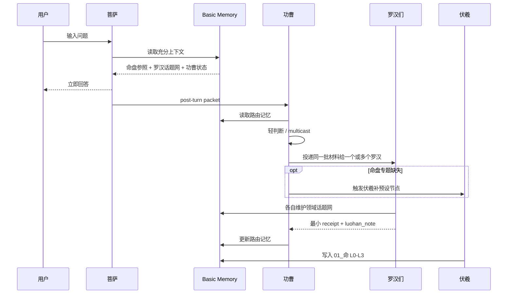

# fate-and-fortune 当前设计总纲与设计理由

本文档沉淀 `fate-and-fortune` 当前原型的整体设计、核心理念和关键取舍。

它不是接口说明，也不是单个模块文档；它回答的是：

```text
我们到底在做什么？
为什么要这样设计？
这套系统如何围绕一个人长期生长？
每个 Agent 为什么站在现在这个位置？
哪些地方是当前方向必须坚持的边界？
```

## 1. 项目本质

`fate-and-fortune` 不是一个“算命结果展示页”，也不是把八字、紫微、MBTI、塔罗等工具堆在一起的报告生成器。

它要验证的是一套以人为核心的长期理解系统：

```text
一个人的发展路径
= 命盘底色
+ 现实事件
+ 执行目标
+ 外部环境
+ 关系演化
+ 资源承载
+ 持续校准
```

命盘不是前台产品承诺，而是隐藏的结构化参照。真正面向用户的体验应该是：

```text
它懂我
它能跟上我
它能记住我
它能把我当前的生活局面讲清楚
它能帮我把下一步变得更可承接
```

因此，系统的重心不是一次性“解析透一个盘”，也不是一次性“生成一篇很长的报告”，而是建立一个可以随着用户对话、现实变化、关系变化和阶段变化持续生长的长期个人记忆系统。

## 2. 为什么以人为核心，而不是以报告或知识库为核心

早期设计容易走向两个方向：

```text
方向一：排盘解析系统
出生信息 -> 八字/紫微 -> 报告 -> 用户阅读

方向二：碎片 RAG 系统
用户每说一句 -> 切成知识片段 -> 检索 -> 回答
```

这两个方向都不够。

排盘解析系统的问题是：它可以很专业，但很容易停留在“命盘解释命盘”。用户真正关心的是当前的人生处境、关系、目标、资源、选择和变化。只解释命盘，无法长期跟随一个人。

碎片 RAG 系统的问题是：它可以存很多内容，但很容易变成无结构的资料堆。Agent 每次检索到一堆片段，却不知道这些片段在用户生命结构里的位置，也不知道哪些是根、哪些是枝叶、哪些只是当时情绪。

当前设计选择第三条路：

```text
命盘提供底色和时间骨架
现实对话提供事件轴和校准信息
五域记忆承载用户现实人生
Agent 通过长期上下文持续理解和回应
```

也就是说，系统不是围绕“报告”生长，而是围绕“这个人”生长。

## 3. 两条时间线：命盘时间轴与现实事件轴

用户最关键的判断是：八字和紫微构成一个人的基础时间骨架，但现实事件是另一个分支。

所以当前系统把两条线分开：

```text
命盘时间轴：
出生资料
-> 本命底色
-> 大运/大限
-> 流年/阶段触发
-> 命盘层面的倾向、结构、节律

现实事件轴：
用户表达
-> 真实事件
-> 目标变化
-> 环境变化
-> 关系变化
-> 资源变化
-> 用户确认、否定、修正
```

两条线结合起来，才是用户的发展路径。

命盘轴不能吞掉现实事件。现实事件也不能反过来随意改写命盘事实。它们之间应该是参照、印证、校准和修正关系。

这就是为什么 `01_命` 由伏羲维护，而 `02_愿`、`03_境`、`04_缘`、`05_力` 由罗汉维护。

## 4. 五域结构

当前系统采用五个长期领域：

```text
01_命：命盘底座与命理时间结构
02_愿：愿景、目标、执行与当下想去哪里
03_境：城市、行业、家庭、组织、社会等外部场域
04_缘：血缘、亲密、朋友、商业、浅层关系等关系网络
05_力：时间、精力、健康、现金、能力、工具、人脉、试错额度等承载力
```

这五域不是为了做一个漂亮分类，而是为了回答一个人的真实问题：

```text
他是谁？
他想去哪里？
他处在什么场里？
谁在影响他？
他有什么力量和承载？
当前阶段他该如何顺势、借势、避险、落地？
```

### 4.1 命

`命` 是底色和时间骨架。

它包括：

- L0 排盘事实：八字、紫微、计算配置、不确定性。
- L1 终身底色：本命结构、长期张力、内在机制。
- L2 阶段入场：大运、大限、当前十年、阶段性主场。
- L3 观变应事：流年、专题、现实问题对应的命盘参照。

命盘只提供参照，不直接宣判现实。

### 4.2 愿

`愿` 记录用户想成为、想保留、想逃离、想建立、想完成的东西。

它有纵向层次：

```text
L0 愿景：理想人生、理想生活、终极方向
L1 大目标：未来几年阶段方向
L2 短期目标：未来几个月的目标与选择
L3 当前执行：今天、本周、当前阻力和动作
```

很多用户一开始说不清 L0/L1，因此系统需要从长期表达中推测，再用温和方式和用户印证。

### 4.3 境

`境` 记录外部场域。

它不是简单的“环境变量”，而是用户正在被哪些场塑造、限制、支持或消耗：

- 城市。
- 行业。
- 家庭。
- 学校。
- 公司。
- 社群。
- 时代技术。
- 规则制度。
- 地域与迁移。

环境必须按时间展开，因为同一个环境在不同阶段对人的意义不同。

### 4.4 缘

`缘` 记录关系。

关系不是联系人列表，而是影响用户生命路径的牵引结构：

- 血缘关系。
- 亲密关系。
- 核心朋友。
- 商业关系。
- 浅层关系。

关系也有纵向变化：亲近、疏远、承诺、背叛、合作、依赖、边界、旧角色、新位置，都会随着时间变化。

### 4.5 力

`力` 记录承载能力。

它不是“资源清单”，而是一个人能不能把愿望落到现实里的真实支撑：

- 时间。
- 精力。
- 健康。
- 现金流。
- 资产。
- 技能。
- 工具系统。
- 人脉信用。
- 家庭支持。
- 试错额度。

很多问题表面是目标问题，实际是承载力问题。`力` 的存在是为了防止系统只谈理想，不看现实能不能扛住。

## 5. Agent 角色体系

当前系统不是单 Agent 架构，而是分为四类角色：

```text
伏羲：命盘解读与专题报告
菩萨：面向用户的即时回应
功曹：每轮后置轻分发与通讯记忆
罗汉：四域长期记忆维护
```

这几个名字不是装饰，而是职责边界。

### 5.1 伏羲：地基

伏羲负责 `01_命`。

它处理八字和紫微的深度解盘，但不直接面向用户，也不维护现实生活记忆。

伏羲的核心流程：

```text
出生资料
-> L0 Chart Asset
-> 16 个初始化节点
-> L1/L2/L3 命盘参照
-> 后续按需补充预设节点
```

伏羲的关键原则：

- 开源库只负责排盘事实。
- 深度解读交给伏羲节点提示词和大模型。
- 所有节点引用同一个 `chart_asset_id`。
- 不在每个节点里重复排盘。
- B09 全生命周期流年报告不初始化，只按需生成。

这样做的理由是：命盘底座必须扎实，但不能一开始就把全部可能性穷尽。八字和紫微的组合无法穷举，真正重要的是让模型基于足够完整的事实和明确的方法论进行深度推演。

### 5.2 菩萨：前台回应

菩萨是用户真正感受到的系统。

它的任务是：

```text
接收用户表达
-> 读取充分上下文
-> 理解用户此刻真正的问题
-> 用生活语言回应
-> 给出可承接的下一步
-> 生成回写候选给功曹
```

菩萨不直接写长期记忆，因为前台回应和长期归档是两种不同工作。前台需要同理、判断、表达；长期记忆需要审慎、分层、保留原文、处理冲突和更新旧节点。

如果让菩萨同时负责回答和写库，它会很容易把当前对话里的表达直接固化成长期判断。

### 5.3 功曹：轻分发与通讯记忆

功曹不是中央大脑。

它不负责理解一个人的全部人生，也不替罗汉做分类。它只做三件事：

```text
记录本轮事实与回写候选
判断是否需要投递给一个或多个罗汉
维护通讯层面的路由记忆和回执
```

功曹存在的原因是：菩萨回答用户时不应该等待后台写库；罗汉也不应该直接被前台调用打断。功曹在中间做轻分发，让主线和支线形成一个稳定 loop。

功曹可以 multicast 同一材料给多个罗汉，因为真实生活问题通常同时涉及愿、境、缘、力。

### 5.4 罗汉：领域话题网维护者

罗汉分别维护：

```text
愿罗汉 -> 02_愿
境罗汉 -> 03_境
缘罗汉 -> 04_缘
力罗汉 -> 05_力
```

罗汉不是表格填写员。每个罗汉要维护自己的领域话题网。

话题网不是预设死分类，而是跟随用户表达自然长出来：

- 有的人围绕人组织记忆。
- 有的人围绕项目组织记忆。
- 有的人围绕城市和阶段组织记忆。
- 有的人围绕压力、资源、承诺、边界组织记忆。
- 同一个人不同阶段的组织方式也会变化。

所以罗汉的职责不是把材料塞进固定格子，而是：

```text
整体阅读 batch
-> 判断哪些值得记录
-> 优先更新已有节点
-> 必要时新建节点
-> 保留用户原文
-> 分开事实、推测、待印证、确认、冲突
-> 让领域话题网逐渐变清楚
```

这正是“模糊的正确”的落地方式：不追求穷尽所有类型，而是给 Agent 一套生长准则，让它根据用户自身的表达方式形成结构。

## 6. 主线与支线

当前系统是一条主线、两个支线环。



### 6.1 主线

主线是：

```text
用户 -> 菩萨 -> 用户
```

主线必须快。用户输入之后，菩萨读取上下文并立即回应，不等待后台全部完成。

### 6.2 记忆支线

记忆支线是：

```text
菩萨回写候选 -> 功曹 -> 罗汉 -> Basic Memory -> 功曹路由记忆
```

它可以异步。后台慢一点不是核心问题，只要能最终沉淀、可审计、下一轮可读取。

### 6.3 命盘支线

命盘支线是：

```text
L0 Chart Asset -> 伏羲初始化 -> 伏羲按需补节点 -> 01_命
```

伏羲既有初始化流程，也有后续补充流程。初始化是地基，按需补充是当现实问题需要更细命盘参照时再生成。

## 7. 为什么使用 Claude Code 作为 Agent 引擎

当前版本从 OpenCode 主链路切换到 Claude Code，核心原因不是“换工具”，而是为了更自然地发挥 Agent 能力。

Claude Code 的价值在这里不是代码生成，而是：

- 原生长期 session 能力更适合每个 Agent 维护自己的工作上下文。
- `claude -p` 适合脚本化、容器化、可审计地调用 Agent。
- MCP 调用、工具边界、输出流和进程控制可以被 Host 统一管理。
- Agent prompt 可以作为清晰的 Soul 文件沉淀，而不是散落在代码判断里。

当前 session 策略：

```text
菩萨：每个 slug 一个长期 session
功曹：每个 slug 一个长期 session
四个罗汉：每个 slug / 每个领域一个长期 session
伏羲：单节点任务，不维护长期 session
```

长期 session 是 Agent 工作上下文，不是事实真源。事实真源仍然是 Basic Memory Markdown。

## 8. 为什么使用 Basic Memory，而不是先上 PostgreSQL 或图数据库

一开始曾考虑 PostgreSQL、软图、pgvector、DB MCP 等方案。但当前原型最终选择 Basic Memory，原因是：

```text
我们当前最需要验证的不是数据库性能，
而是这套“人如何被长期理解和沉淀”的结构是否成立。
```

Basic Memory 的优势：

- Markdown 是人能直接审阅的真源。
- Claude Code Agent 天然适合读写 Markdown。
- observations / relations 可以提供轻量图结构。
- MCP 可以作为统一工具边界。
- 一人一 project 很容易隔离。
- 后续迁移到数据库时，有清晰的领域结构和真实样本。

Basic Memory 内部的 SQLite 只是索引实现，不是业务数据库。系统设计层面坚持：

```text
业务真源 = Markdown note
检索索引 = Basic Memory 内部实现
运行审计 = JSONL / report / transcript
```

当前不上图数据库，是因为过早图建模会逼迫我们定义过多边类型，而用户真实人生里的关系和影响无法穷尽。现阶段更重要的是让罗汉维护自然语言话题网，用空间换时间，但不把模糊生命结构过早硬编码成固定 schema。

## 9. 为什么代码要薄，判断交给 Agent

本项目坚持：

```text
代码负责通信、调度、权限、排盘事实、日志、容器、审计。
Agent 负责理解、判断、归纳、解读、回应、沉淀。
```

代码不应该硬编码：

- 八字/紫微解读规则。
- 用户话语属于哪个领域。
- 哪句话值得长期记忆。
- 某个关系应该如何命名。
- 某个事件如何推导人生结论。

这些判断都具有高语义、高语境、高不确定性。硬编码会让系统变窄，最后变成一套僵硬问卷。

但代码必须硬起来的地方包括：

- 容器隔离。
- 每个 slug 的 project 隔离。
- role-scoped MCP 写权限。
- Fuxi 初始化必须先有 L0 Chart Asset。
- B09 不初始化。
- Host 不做业务判断。
- 所有事件可审计。
- 模型 key 不进代码、文档、日志、记忆。

也就是说：

```text
语义判断要柔。
工程边界要硬。
```

这是当前设计最重要的原则之一。

## 10. L0 Chart Asset 的意义

L0 Chart Asset 是伏羲的硬前置。

流程：

```text
出生资料
-> lunar-javascript 计算八字事实
-> iztro 计算紫微事实
-> 记录 calculation_profile
-> 记录 doctrine_profile
-> 记录时区、出生地、真太阳时不确定性
-> 生成 chart_asset_id
-> 写入 01_命/_chart_assets/
-> 写入 L0_排盘事实档案
-> 伏羲节点引用同一个 chart_asset_id
```

这样设计有几个原因：

1. 排盘事实和命理解读必须分离。
2. 每个伏羲节点不能各自重新排盘，避免事实底座不一致。
3. 计算引擎只提供事实，不承担解释。
4. doctrine profile 明确告诉伏羲当前采用什么默认解读路径。
5. 不确定性必须记录，而不是假装出生地、真太阳时、闰月规则都没有影响。

默认底座：

```text
八字：lunar-javascript
紫微：iztro
八字解读：子平 / 月令旺衰 / 格局 / 调候 / 五行流通 / 十神现实转译
紫微解读：三合为体 / 四化为用 / 大限流年为时间主场
```

开源库只是排盘工具。深度理解和推演由伏羲完成。

## 11. 伏羲 16 节点初始化策略

初始化只生成 16 个基础节点：

```text
A01 本命总解
A02 八字气候报告
A03 紫微生命地图
A04 一生命势报告
A05 命盘机制卡报告
B06 全生命周期大运大限报告
B07 当前十年深解
B10 当前流年报告
C13 事业成事报告
C16 财富资源报告
C18 合作团队报告
C19 学习认知报告
C20 表达内容报告
C24 健康精力报告
C25 福德内在报告
D28 亲密关系报告
```

B09 全生命周期流年报告不初始化。

理由：

- B09 太重，初始阶段复用率低。
- 全生命周期逐年展开容易污染记忆。
- 用户现实问题通常先集中在当前阶段和少数高频领域。
- 需要某年、某主题、未来 N 年时，再按需生成更深报告。

伏羲的目标不是穷尽全部命理可能，而是先搭建足够深、足够复用的基础地基。

## 12. 记忆如何生长

每轮对话后，系统不是简单追加聊天记录，而是通过功曹和罗汉把有效信息沉淀成长期结构。

基本规则：

```text
原文优先
事实和推测分开
确认和待印证分开
冲突不删除
旧 note 优先更新
重复内容合并沉降
新主题才新建 note
```

罗汉维护的是话题网，而不是固定枚举。

一个用户可能自然形成：

```text
以人为中心的话题网
以项目为中心的话题网
以时间阶段为中心的话题网
以城市/迁移为中心的话题网
以压力源/资源瓶颈为中心的话题网
```

系统不提前决定用户应该是哪一种，而是让罗汉根据用户表达逐渐组织。

这避免了两个极端：

- 不结构化：什么都存，最后无法读。
- 过度结构化：什么都套进固定字段，失去真实生命纹理。

## 13. 读取策略

菩萨回答前必须读取充分上下文，但“充分”不等于读全部。

理想读取方式：

```text
当前问题
-> 搜索相关 note
-> 读取命盘参照
-> 读取愿/境/缘/力相关话题网
-> 读取功曹近期状态
-> 形成自己的工作上下文
-> 回答用户
```

Basic Memory 是真源，但每个 Agent 仍要自己构建上下文。系统不设置一个中心 Context Agent，因为不同角色需要不同上下文：

- 菩萨需要回应上下文。
- 功曹需要路由上下文。
- 罗汉需要领域维护上下文。
- 伏羲需要命盘节点上下文。

## 14. 容器化和审计页

`fate-and-fortune` 作为独立子项目和独立容器存在，不接入 root workspace。

容器原则：

- container name: `fate-and-fortune`
- 单容器 + volume。
- 不读取宿主机 OpenCode/Claude/Basic Memory 配置。
- runtime、logs、memory projects 都在容器路径。
- 模型 key 只走环境变量。

审计页：

```text
GET /
GET /{slug}
GET /api/{slug}/status
GET /health
WS /ws?slug={slug}
```

`/{slug}` 页面不是正式产品页，而是调试和验证页。它必须能看到：

- 菩萨回复。
- Agent 调用顺序。
- 工具调用。
- 功曹 dispatch。
- 罗汉 receipt。
- 伏羲节点进度。
- memory diff。
- transcript。
- 错误和耗时。

原因很简单：这套系统复杂，不能靠“感觉跑了”来判断。必须能复盘每一轮真实调用是否符合设计。

## 15. 当前验证结果

当前原型已经完成 Tesla 传记视角的真实链路验证。

最终 clean segment 覆盖 turns 82-100：

```text
events: 2095
agent_started: 151
agent_done: 151
tool_call: 1227
assistant_message: 20
post_turn_packet: 19
gongcao_dispatch: 65
luohan_receipt: 66
background_idle: 19
contract_errors: 0
config_errors: 0
provider_fallbacks: 0
chart_asset_done: 1
fuxi_node_done: 16
fuxi_node_error: 0
```

观察到的正向效果：

- 菩萨回答能维持温和、生活化、非玄学前台语言。
- 功曹能后置分发，不阻塞用户回复。
- 罗汉开始围绕用户表达自然长出话题网。
- 伏羲完成 16 节点初始化，B09 没有误初始化。
- Basic Memory 中形成了可审阅的 Markdown 记忆。

观察到的问题：

- 功曹和部分罗汉随着记忆增长会变慢。
- note 容易变长、重复，需要 active index / context pack / 定期沉降。
- 菩萨有时回答过于规整，需要更多真实、碎片化、非文学化用户表达测试。
- 伏羲底盘已经存在，但在普通现实对话中是否被深度使用，还需要专门测试。

## 16. 当前设计的真正风险

异步不是当前最核心风险。功曹和罗汉本来就是后台支线，只要菩萨先回答、后台最终沉淀、下一轮能读到更新，异步可以接受。

真正风险有四个：

### 16.1 记忆膨胀

如果每轮都写很多内容，Basic Memory 会从“长期记忆”变成“长篇垃圾堆”。

需要通过领域 active index、阶段总结、归档和合并来控制。

### 16.2 回答模板化

菩萨如果每轮都用同一种漂亮结构，短期效果好，长期会显得机械。

需要用更多真实用户表达测试它能否处理混乱、反复、短句、否定、突然换话题。

### 16.3 伏羲深度未完全证明

伏羲初始化跑通不等于命盘真的参与了高质量推理。

还需要专门设计问题验证：

- 当前十年怎么看。
- 某一年是否适合某选择。
- 职业/关系/健康/迁移如何结合命盘周期。
- 高风险决策时，伏羲补节点是否能提供有用参照。

### 16.4 过早工程化

如果太早把关系、边类型、事件类型、判断标准全部 schema 化，会背离当前最重要的方向：让系统根据用户自然表达长出结构。

当前应该保持：

```text
工程边界清楚
语义结构柔软
记忆可审阅
Agent 有足够空间理解
```

## 17. 后续重点

当前最值得继续推进的不是再加大模块，而是把已有链路做深：

1. 伏羲有效性专项测试：用明确命盘/周期/决策问题验证底盘是否真的参与推理。
2. 罗汉 active index：每个领域维护短小、当前可读的话题地图。
3. 记忆沉降机制：定期合并重复 observation，归档过期阶段。
4. 更真实用户表达测试：短句、情绪化、反复、否定、跳跃、低信息密度。
5. 菩萨表达打磨：减少模板感，让回答更贴近用户当下语气。
6. 审计页继续保留：直到真实链路足够稳定，再考虑产品页。

## 18. 一句话总结

这套设计的核心不是“用 AI 算命”，而是：

```text
以八字和紫微建立一个人的底色与时间骨架，
以长期对话沉淀他的现实事件、目标、环境、关系和资源，
用多 Agent 分工保持前台回应、后台记忆、命盘参照和领域维护之间的清晰边界，
让系统随着这个人的人生变化而持续理解他。
```

因此，当前系统必须坚持：

```text
以人为核心。
命盘是地基，不是镣铐。
记忆要生长，不是堆积。
Agent 做理解，代码守边界。
前台像菩萨，后台像工坊。
```
