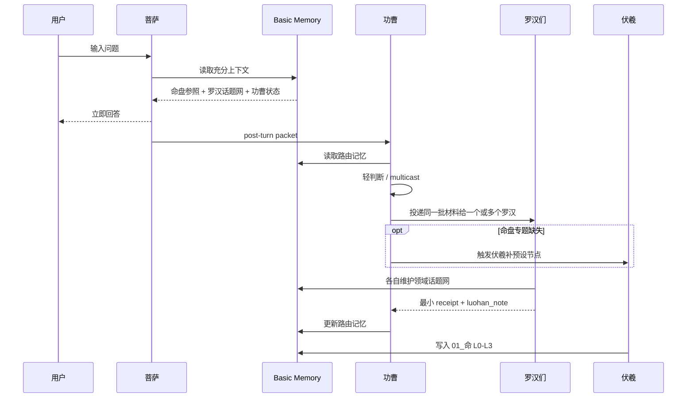

# Gongcao Routing

功曹是主线之后的轻分发器，不是中央大脑。

## Position



## Inputs

功曹串行读取两类 backlog：

- `post_turn_packet`：用户原文、菩萨回复、菩萨回写候选。
- `agent_receipt`：罗汉或伏羲的最小回执。

## Store

功曹只写 `06_功曹/`：

```text
routing-memory.md
events.jsonl
dispatch.jsonl
receipts.jsonl
```

`routing-memory.md` 记录每个罗汉大概维护了哪些信息，哪些主题近期活跃，哪些任务失败/待重试。它是通讯索引，不是用户画像。

## Dispatch

功曹输出：

```text
NO_ACTION
LOG_ONLY
DISPATCH_LUOHAN
TRIGGER_FUXI
ASK_CLARIFICATION_LATER
MIXED
```

同一材料可以 multicast 给多个罗汉。给罗汉的 envelope 只包含：

- 场景。
- 用户原文。
- 菩萨摘要或可见回复。
- 投递说明。

功曹不替罗汉命名话题，不规定罗汉写什么，不替罗汉总结领域结构。

## Receipt Loop

罗汉回执格式：

```json
{
  "status": "done",
  "touched": [],
  "luohan_note": "由罗汉自己概括",
  "needs_retry": false
}
```

功曹收到 receipt 后默认 `LOG_ONLY`：

- 写入 receipt 审计。
- 更新 `routing-memory.md`，记录哪个罗汉大概维护了哪些信息。
- 把 `luohan_note` 里的转交建议沉淀为下一轮路由参考。

同一轮不因为 `luohan_note` 里的“建议转交/同步投递”继续扩散。只有 receipt 顶层 `needs_retry: true`，或 `status` 为 `error` / `needs_more_context` / `contract_error` 时，才允许同轮继续调度。

伏羲也只在 receipt 明确说明某个预设节点缺失且当前问题无法承接时补触发。

## Fuxi Trigger

功曹只能触发伏羲预设节点。伏羲写 `01_命` L0-L3，不写现实记忆。
